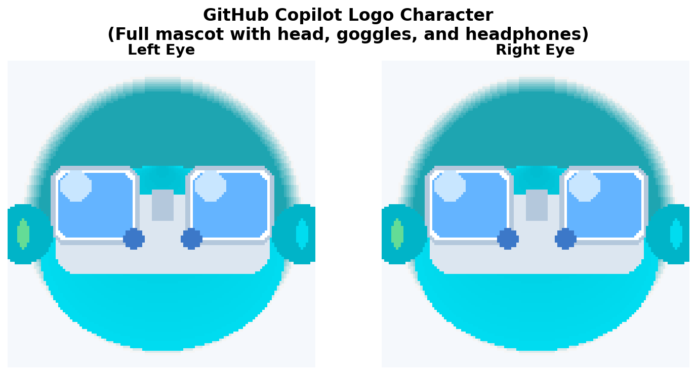

# GitHub Copilot Eyes for Furby Connect

This directory contains custom eye images designed to display the GitHub Copilot logo on Furby's eyes with animated pulsing effect.



## Files

- `left.gif` - Left eye image with Copilot logo (128x128, 64-color palette)
- `right.gif` - Right eye image with Copilot logo (128x128, 64-color palette)
- `left_0.gif` through `left_3.gif` - Animation frames for left eye
- `right_0.gif` through `right_3.gif` - Animation frames for right eye
- `preview.png` - Preview image showing both eyes

## Features

- **Animated pulsing effect**: Subtle breathing animation with 4 frames
- **Cyan/blue gradient**: Matches GitHub Copilot's brand colors
- **Hexagonal design**: Inspired by the GitHub Copilot logo
- **Glowing effect**: Outer glow creates a luminous appearance

## Usage

To create a custom DLC with the animated Copilot logo on Furby's eyes:

```bash
python copilot_eyes.py
```

This will generate a `copilot_furby.dlc` file with animated eyes that can be uploaded to your Furby Connect.

For static (non-animated) eyes:

```python
from copilot_eyes import make_copilot_eyes
make_copilot_eyes(animated=False)
```

**Note**: This repository was originally written for Python 2. If you encounter compatibility issues with Python 3, you may need to use Python 2 or apply Python 2to3 conversion to the `furby.py` file.

## Image Specifications

The eye images follow the Furby Connect DLC specifications:
- **Size**: 128x128 pixels
- **Format**: GIF with indexed color palette
- **Colors**: Up to 64 colors in the palette
- **Design**: Features the GitHub Copilot logo design in cyan/blue gradient tones
- **Animation**: 4 frames with subtle pulsing effect

## Customization

You can create your own eye images by following these specifications. For animated eyes, create multiple frames named `_0.gif`, `_1.gif`, etc. The images will be automatically converted to the appropriate format when processed by the `copilot_eyes.py` script.
